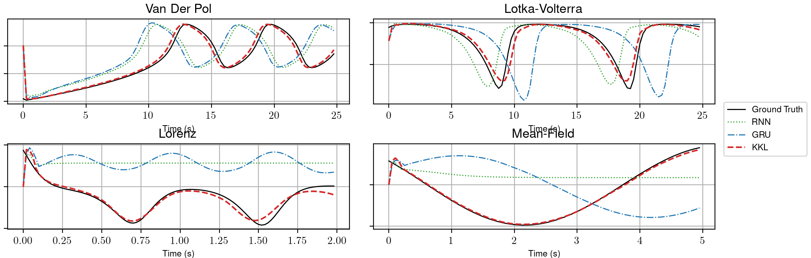
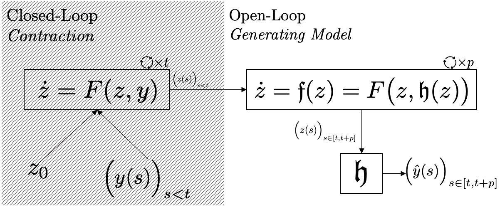

# DeepKKL

This repository contains the code associated to the paper ["Deep KKL: Data-driven Output Prediction for Non-Linear Systems", S. Janny, V. Andrieu, M. Nadri, C. Wolf](https://arxiv.org/abs/2103.12443).



## Abstract
We address the problem of output prediction, ie. designing a model for autonomous nonlinear systems capable of forecasting their future observations. We first define a general framework bringing together the necessary properties for the development of such an output predictor. In particular, we look at this problem from two different viewpoints, control theory and data-driven techniques (machine learning), and try to formulate it in a consistent way, reducing the gap between the two fields. Building on this formulation and problem definition, we propose a predictor structure based on the Kazantzis-Kravaris/Luenberger (KKL) observer and we show that KKL fits well into our general framework. Finally, we propose a constructive solution for this predictor that solely relies on a small set of trajectories measured from the system. Our experiments show that our solution allows to obtain an efficient predictor over a subset of the observation space.

## Model


## Data Generation
Training data have been simulated by integrating the associated ODE. Scripts can be found in ```data_generation/```. We simulate the systems with a frequency ten times superior to the final trajectories.

## Model training and evaluation
Model can be trained with ```train_model.py```. Use args to select the model (RNN, GRU or KKL) and the system.